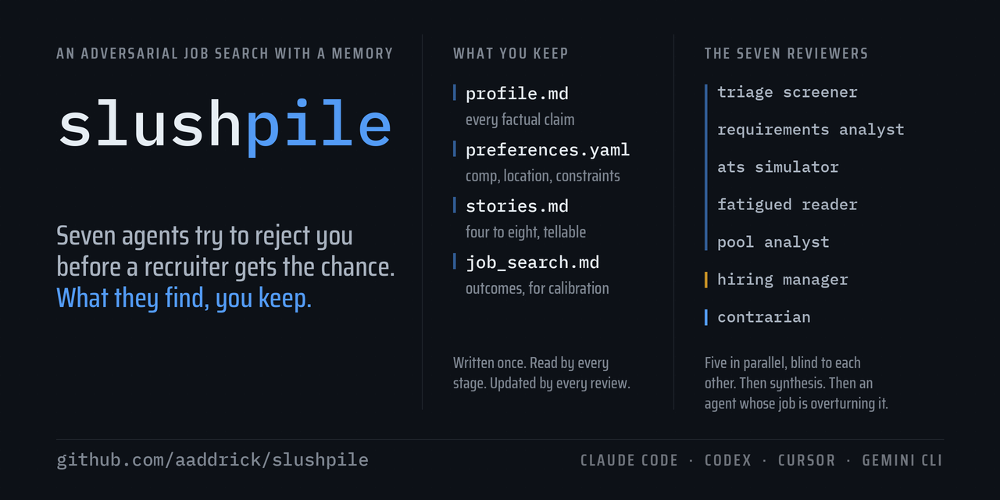

<p align="center">
  
</p>

<p align="center">
  <strong>Slushpile</strong><br>
  <em>7个智能体抢在招聘人员之前把你拒掉。</em><br>
  <em>它们发现的东西归你。</em>
</p>

<p align="center">
  <a href="../../LICENSE"></a>
  <a href="../../.github/workflows/plugin-load-check.yml"></a>
</p>

<p align="center">
  <a href="https://www.linkedin.com/in/aaddrick/">在 LinkedIn 上联系我！</a>
</p>

<!-- BEGIN GENERATED language-nav: scripts/sync_docs.py -->

<p align="center">
  <a href="../../README.md">English</a> ·
  <strong>简体中文</strong> ·
  <a href="../es/README.md">Español</a> ·
  <a href="../pt-BR/README.md">Português (BR)</a> ·
  <a href="../vi/README.md">Tiếng Việt</a>
</p>

<!-- END GENERATED language-nav -->

<!-- BEGIN GENERATED market-note: scripts/sync_docs.py -->

> **适用范围**：本流水线针对英语国家（尤其是美国）的招聘惯例设计：简历一页、不放照片、不写出生日期、按时间倒序、并附上工作许可说明。若你投递的是使用标准化简历表格的本地岗位，其中的版式建议并不适用，审阅也会把本地惯例判为缺陷。相关讨论见 [issue #2](https://github.com/aaddrick/slushpile/issues/2)。

<!-- END GENERATED market-note -->

## 安装

<details open>
<summary><strong>Claude Code</strong></summary>

```bash
claude plugin marketplace add aaddrick/slushpile
```

```bash
claude plugin install slushpile@slushpile
```

然后，在你放求职资料的目录里：

```
/slushpile:onboard
```

</details>

<details>
<summary><strong>Codex</strong></summary>

```bash
codex plugin marketplace add aaddrick/slushpile --ref main
```

```bash
codex plugin add slushpile@slushpile
```

Codex 会给插件技能加上插件名前缀：

```
$slushpile:onboard
```

Codex 没有子智能体调度，所以审阅流水线会在同一个上下文里顺序跑完7个角色，而不是让其中5个并行审阅者同时开工。输出一样，只是更慢，而且一个角色的推理稍微更容易渗进下一个。

</details>

<details>
<summary><strong>Cursor、Gemini CLI，以及手动安装</strong></summary>

见 [INSTALL.md](./INSTALL.md)。

</details>

## 问题所在

给你打分的不是那份职位描述。给你打分的是这周投了同一个岗位的另外七十个人。

这个领域里几乎每个工具都把这件事搞反了。把一份简历和一个职位投喂给简历优化器，它会告诉你关键词匹配度从 68% 涨到了 91%——一个真实的数字，回答的却是错误的问题。如果那个队列里第 75 百分位的申请者匹配度是 94%，你的 91% 就是一封拒信，而工具永远不会告诉你这一点。

它们搞错的第二件事：只给一个判定。但同一份简历、同一封信，走冷投门户可能转化 2%，走内推可能转化 30%。这不是同一个决定，把它们压成一句"高度匹配"不是简化，是错误，外面还罩了一层自信的界面。

第三件事没人点破。这些工具没有记忆。你粘一份简历进去，拿一个数字回来，关掉页面，工具结束会话时知道的东西和开始时一模一样。一次求职是三个月里四十份申请。每一份都付全价。

## 这个工具怎么做

**它给你建一次模型。** `/slushpile:onboard` 会面谈你，然后写三个文件：一份档案、一个偏好文件、一组故事。这份档案不是简历——它是简历要从里面反复裁剪出来的那个池子，比你会寄出去的任何东西都长好几倍。后面每个阶段都读它，而那些问题不会再问你第二遍。

**在你动笔之前，它先劝你别投这个岗位。** 搜索阶段把每个职位对着估算出来的申请者池打分，跑淘汰条件，按申请渠道建一张期望值矩阵，并在分级列表前面放一个唱反调者。别的工具都是在你已经决定要投之后才开始干活。而昂贵的错误发生在那之前，这是唯一一个还能免费拦住它的阶段。

**它攻击自己刚写出来的东西。** 一个模型被问到自己的草稿好不好，会长篇大论地告诉你好。所以构建器不问。它把简历和求职信交给7个审阅者，其中有5个并行审阅者，彼此看不到对方的发现，每个只拿到它这个角色在现实中真正会拿到的东西——那个 11 秒的初筛者永远看不到求职信，因为读了信的筛选者就不是筛选者了。构建器修好返回来的问题，再送一轮。第二轮必须站得住，它才会放你去投；到第三轮就停，因为再往后差距是结构性的，继续改只是空转。

**它把学到的东西写回你身上。** 当一次审阅说某一段单薄时，接下来的面谈通常会发现那段经历是真的，只是你从没写下来。那件事会永久进入档案。转化率估计会对着你记录的真实结果做修正。你的第二十份申请起点比第一份高——这在别的任何工具里都根本不成立。

出来的是每个渠道一个判定——冷投、熟人内推、主动联系、靠你的公开作品被找上门——每个都带一个概率区间而不是一个判定词，而且材料质量与期望值是分开打分的。"1-3% 面试率"是信息，"MAYBE"不是。寄给一个不匹配岗位的优秀材料，期望值照样很低，而这两个数字经常互相打架。

## 差别在哪

同一份简历，同一个职位，同一个下午。

### 简历优化器告诉你的

> **匹配度：91%** ✅
>
> 好消息——你的简历跟这个岗位高度匹配！
>
> ✅ 16 个必需关键词命中 14 个
> ✅ 检测到 ATS 友好的排版
> ⚠️ 建议补充："stakeholder alignment"、"OKRs"
>
> 你可以投了！

### Slushpile 告诉你的

> **申请者池内位置：p55。** 这里的中位申请者曾在招聘经理认得出的公司里做过相当规模的东西。你的开源工作是真的，但在这个申请者池里并不稀有——p75 那一档里大约三分之一的人有等价的东西。
>
> **冷投：REJECT，1-3%。** 表单上的工作年限下拉框卡在 8 年。你在这个职称对应的职能上有 6 年。
>
> **熟人内推：MAYBE，20-30%。** 这是唯一一条有真实路径的渠道。
>
> **材料质量：8/10。** 材料不是问题所在。
>
> **唱反调者：** SUBMIT_AS_PORTFOLIO_ONLY。冷投这一份要花一小时，换一个 2% 的机会。花两小时找一条内推，比再多投十份冷投值钱。

其中一个是关于你的文档的数字。另一个是关于你这个下午的决定。

## 流水线

<!-- BEGIN GENERATED pipeline: scripts/sync_docs.py -->

### The main pipeline

Three commands, in order. A search runs on these alone.

```
/slushpile:onboard              once per workspace — builds your profile,
                                preferences, and stories

/slushpile:job-board-search     search a careers board, extract postings,
                                score pool-anchored fit, contrarian gate,
                                create role folders

/slushpile:application-builder  build the resume and cover letter, then
                                iterate them against the review until they
                                stabilize
```

### The three it runs for you

`/slushpile:application-builder` dispatches all three of these itself, in the
course of building an application. Run one directly only to work on materials
this pipeline did not build — a resume written elsewhere, a letter drafted by
hand.

```
/slushpile:explore-experience   interview to surface experience you have
                                but never wrote down

/slushpile:adversarial-review   seven agents, five in parallel, verdict
                                per channel

/slushpile:removing-ai-tells    strip AI-authorship signals from prose,
                                with a gatekeeper on every change
```

### Any time

```
/slushpile:redesign-templates   restyle the resume and letter templates,
                                holding the ATS constraints fixed

/slushpile:status               the queue, what is waiting on you, and whether
                                the pipeline's predictions are holding up

/slushpile:help                 what to run next, and how to read the output
```

<!-- END GENERATED pipeline -->

<!-- BEGIN GENERATED reviewers: scripts/sync_docs.py -->

### The seven reviewers

| Agent | Simulates |
|---|---|
| **Triage screener** | 11 seconds, F-pattern, 347 resumes already read today |
| **Requirements analyst** | 30 seconds, methodical, checks every qualification against evidence |
| **ATS simulator** | A parser. Not a reader. Structure, keywords, and years-of-experience math |
| **Fatigued reader** | Application #61 of 80. What annoys, what gets skimmed, what closes the tab |
| **Pool analyst** | A recruiter who knows what the queue actually looks like |
| **Hiring manager** | The person who has to justify the interview slot to their skip-level |
| **Contrarian** | Whoever should have asked whether any of this was worth doing |

The first five run in parallel and cannot see each other's work. The hiring
manager sees all five. The contrarian sees everything, including the hiring
manager, and can overrule it.

<!-- END GENERATED reviewers -->

## 手册

其余部分在 [docs/](docs/index.md) 里：

- [上手](docs/getting-started.md)：初始化引导之前要准备什么，以及要装什么。
- [技能](docs/skills.md)：每一条命令，以及什么时候跑它。
- [工作区](docs/workspace.md)：这套东西往你目录里写的文件。
- [你的文风智能体](docs/voice.md)、[疑难排查](docs/troubleshooting.md)。
- [架构](docs/architecture/index.md)：那些图、审阅为什么长这样，以及打分和校准是怎么工作的。

## 你的求职信需要你自己的文风

第八个智能体负责写求职信。它按某一个具体的人的风格写，这个风格是从那个人自己写的语料里建出来的。

slushpile 附带 **`aaddrick-voice`** 作为可用示例，好让流水线开箱即跑。那是插件作者的文风，不是你的。用它写出来的信会听起来像一个特定的陌生人——用来看流水线怎么运转没问题，用在你真要寄出去的任何东西上都是错的。

用 **[written-voice-replication](https://github.com/aaddrick/written-voice-replication)** 生成你自己的。它会从 25 个维度分析你的写作语料，输出一个文风智能体、一个文风技能，以及一份带可测量目标的数值档案。`aaddrick-voice` 就是那条流水线自己的示例产物。

然后让 `preferences.yaml` 指向它：

```yaml
voice:
  agent: "your-name-voice"
  is_mine: true
```

只要 `is_mine` 还是 false，每个会起草文稿的技能在运行前都会警告你。挡在你和十二份用陌生人文风寄出去的申请之间的，只有那条警告。

## 你的数据仍然是你的

`/slushpile:onboard` 往*你的*目录里写三个文件：`profile.md`、`preferences.yaml` 和 `stories.md`。流水线用到的每一条个人事实都在那里。插件里没有硬编码任何东西，而且这个仓库有一道 CI 关卡，一旦个人事实泄漏进某个技能就会失败。

那个工作区会装着你完整的工作履历、你的薪酬数字和你的约束条件。把它放在一个**私有**仓库里，或者根本不放进仓库。入职技能会跟你说这件事，而且它不会替你初始化仓库。

**流水线从不替你提交任何东西。** 没有任何技能会碰申请门户、邮件或表单。它只写文件。你读完，你自己寄。

## 诚实才是这个产品

这个工具会告诉你，某个你引以为傲的差异化优势其实是中位水平。它会告诉你，你想要的某个岗位转化率只有 2%。它偶尔会告诉你别投。

那就是产品本身。一条把大部分申请都评成 INTERVIEW、实际只转化 5% 的流水线产出的不是信号，是乐观情绪，而且它会无限期地这么产下去，因为里面没有任何东西会回推一把。唱反调那一轮、以申请者池为锚的打分、按渠道给的概率，全都是为了让输出在它说"不"的时候恰恰最有用。

工作区的追踪文件里有一张 `Calibration` 表，正是为此存在：你记下流水线预测了什么、实际发生了什么，先验就会被你自己的历史修正，而不是被谁的自信修正。

## 自己改

这9个技能和8个智能体都是 Markdown。Fork 它，改它，装你自己那份：

```bash
claude plugin uninstall slushpile
```

```bash
claude plugin marketplace remove slushpile
```

```bash
claude plugin marketplace add <your-username>/slushpile
```

```bash
claude plugin install slushpile@slushpile
```

如果你改了某个技能，推送前先跑那几道关卡。见 [CONTRIBUTING.md](../../CONTRIBUTING.md)。

## 许可证

MIT。见 [LICENSE](../../LICENSE)。
