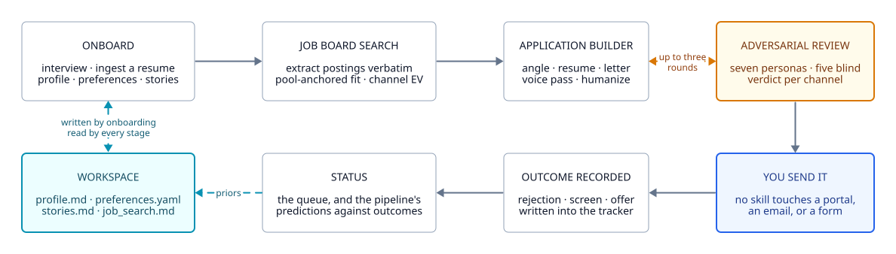
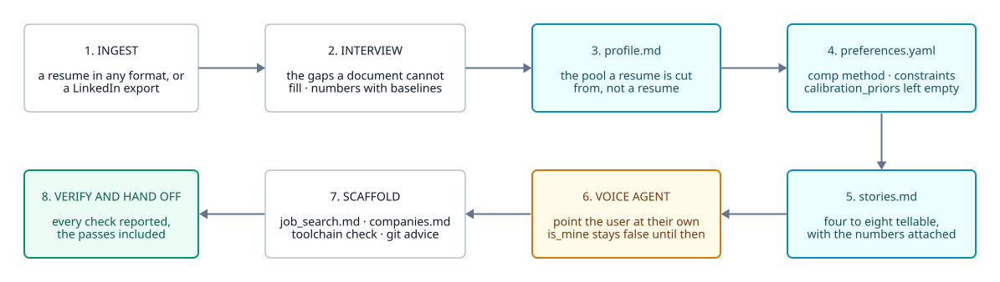
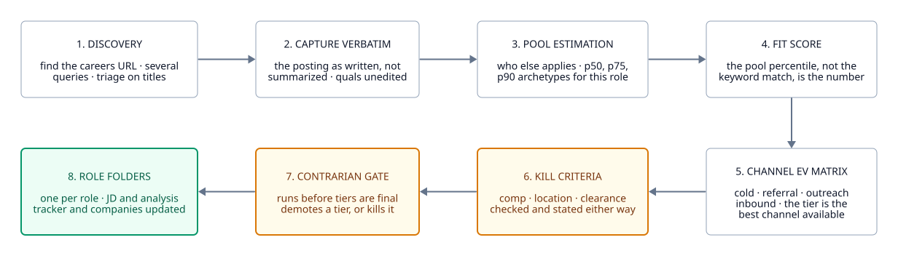
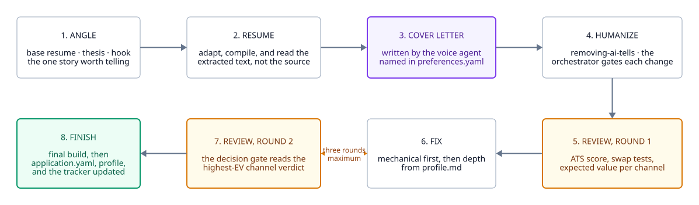
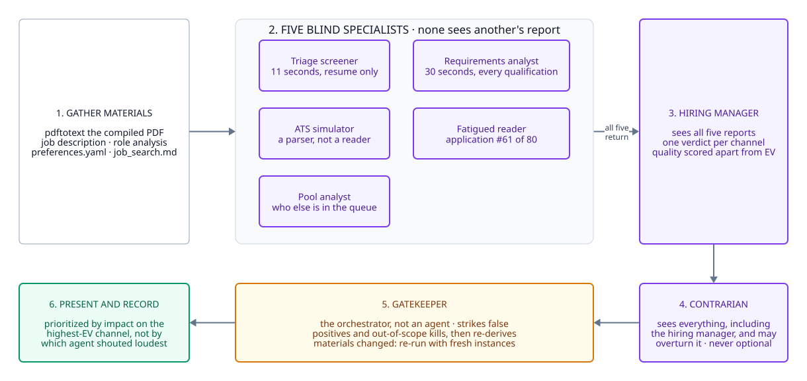

# 流水线，逐阶段拆解

<!-- BEGIN GENERATED language-nav: scripts/sync_docs.py -->

  <a href="../../../../docs/architecture/pipeline.md">English</a> ·
  <strong>简体中文</strong> ·
  <a href="../../../es/docs/architecture/pipeline.md">Español</a> ·
  <a href="../../../pt-BR/docs/architecture/pipeline.md">Português (BR)</a> ·
  <a href="../../../vi/docs/architecture/pipeline.md">Tiếng Việt</a>

<!-- END GENERATED language-nav -->

## 整个循环

<picture>
  <source media="(prefers-color-scheme: dark)" srcset="../../../../docs/diagrams/pipeline-overview-dark.svg">
  
</picture>

主干由三条命令构成：每个工作区跑一次 `onboard`，然后按公司、按岗位分别跑
`job-board-search` 和 `application-builder`。`explore-experience`、
`adversarial-review` 和 `removing-ai-tells` 由 builder 自己调度。

底部那个循环，是简历优化器没有对应物的那部分。结果被记录下来，`status`
把流水线预测过的东西对真实发生的事做回归，校正后的先验回到
`preferences.yaml`，下一次搜索就从那里读它。参见
[memory-and-calibration.md](memory-and-calibration.md)。

## 图例

本页每张图都取自同一套类别词汇，定义在
`docs/diagrams/theme-light.d2` 和 `theme-dark.d2` 里。这两个主题文件和这张表
由 `tests/test_docs.py` 互相校验。

| 类别 | 含义 |
| --- | --- |
| `stage` | 编排技能自己执行的一个普通步骤 |
| `agent` | 一个被调度的角色：带有自己定义（在 `agents/` 中）的子智能体 |
| `gate` | 一道关卡或一个带上限的循环：运行可能在此迭代、停滞或终止 |
| `memory` | 一个持久的工作区文件，写一次，之后每个阶段都读它 |
| `human` | 唯一必须有用户参与的地方 |
| `terminal` | 该图中的终止状态 |
| `phase` | 把一起运行的若干单元框在一起的容器 |
| `flow` | 一条普通的前向边 |
| `loop` | 一条回向边：返工、重审、再来一轮 |
| `writeback` | 一条写入工作区记忆的边 |

`stage` 与 `agent` 之间的区别是最值得仔细读的一处。一个 `agent` 方框是一个子智能体，
有自己的定义和自己的上下文。在无法调度子智能体的宿主环境上，塌缩成同一个上下文的正是这些，
而这次塌缩就是完整运行与降级运行之间的全部差别。

## `/slushpile:onboard`

<picture>
  <source media="(prefers-color-scheme: dark)" srcset="../../../../docs/diagrams/phase-onboard-dark.svg">
  
</picture>

初始化引导是一场访谈，不是一张表单。它只跑一次，之后的一切都读它写下的东西。

其中两步是关卡而非工作。文风智能体那一步拒绝自己去构建文风画像：由几份写作样本临时拼出的
画像，读起来就是模型的默认腔调套上了用户的名字，而用户会因为它看上去很完整而信任它。
这一步把 `voice.is_mine: false` 设好，并转而指向
[written-voice-replication](https://github.com/aaddrick/written-voice-replication)。
验证那一步会说明哪些检查*通过了*，而不只是哪些失败了，因为一项只报告失败的检查，
和一项根本没跑过的检查无法区分。

`calibration_priors` 是刻意留空的。一个凭空捏造的先验，是用户从未选择过的约束，
会因为他们看不见的理由悄悄杀掉一些岗位。它要么日后由真实结果填上，要么就一直空着，
而下游每一个估计值都会被标注为未校准。

## `/slushpile:job-board-search`

<picture>
  <source media="(prefers-color-scheme: dark)" srcset="../../../../docs/diagrams/phase-search-dark.svg">
  
</picture>

这是回报最高的阶段，也是大多数工具没有的那个阶段。下游的一切，每份申请都要花掉用户一个
下午。这个阶段只花几分钟，而且可以以「这些一个都别投」收场。

招聘启事是**逐字**捕获的。后面有3个智能体直接解析这段文本，即需求分析师、ATS 模拟器和
申请者池分析师，而一份被摘要过的启事会悄悄抹掉资格要求的原文措辞，而那正是这三者存在的
意义所在。

唱反调关卡跑在档位定稿*之前*而不是之后，因为用户已经读过的分级列表，就是他们已经认下的
分级列表。档位是什么意思、淘汰条件检查什么，参见 [scoring.md](scoring.md)。

## `/slushpile:application-builder`

<picture>
  <source media="(prefers-color-scheme: dark)" srcset="../../../../docs/diagrams/phase-build-dark.svg">
  
</picture>

构建器先写，然后攻击自己写出来的东西。一个被问到自己的草稿好不好的模型，会长篇大论地说好，
所以构建器从来不问，它把材料交给一场对这些材料没有利害关系的审阅。

修复的顺序很重要。机械性修复排在前面，因为它们便宜且无歧义：缺失的关键词、只写到年份的
日期、一条几乎逐字抄自招聘启事的要点。只有做完这些，它才去尝试昂贵的那一类，也就是必须
从 `profile.md` 里补足一个单薄的段落；而如果材料确实不在画像里，它会运行
`/slushpile:explore-experience`，而不是把它编出来。

**三轮是上限。** 如果到第三轮判定仍未移动，差距就是结构性的，继续编辑只是动作而非进展。
这个上限之所以存在，是因为另一种选择是一个永远能找出点什么的循环，而一场永远能找出点什么的
审阅，和一场什么也找不出的审阅无法区分。

## `/slushpile:adversarial-review`

<picture>
  <source media="(prefers-color-scheme: dark)" srcset="../../../../docs/diagrams/phase-review-dark.svg">
  
</picture>

容器里的5个并行审阅者在同一条消息中调度，彼此看不到对方的发现。每一个只拿到它这个角色
真的会有的东西：初筛者永远不会看到求职信，因为读过求职信的筛选者就不是筛选者了。

守门人是那个编排技能，不是一个智能体。这些角色是刻意刻薄的，它们产出的东西有一部分是错的，
所以必须有什么东西对它们的输出施加判断，而那个东西不能是它们中的一员。

调度顺序、每个角色被扣下了什么、守门人被允许剔除哪些发现，都在
[the-review.md](the-review.md) 里。
